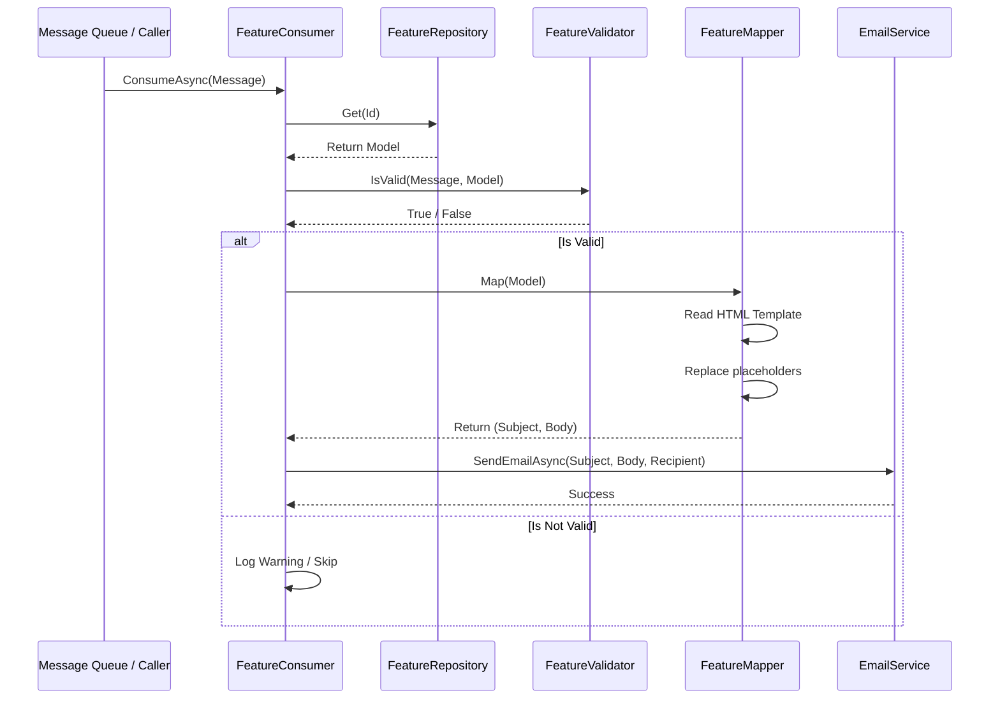
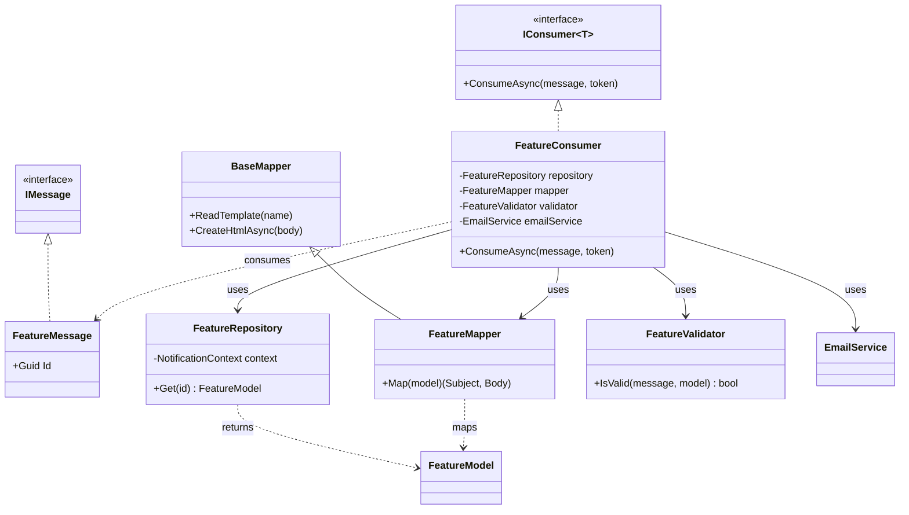

# Architecture Overview

This document describes the architecture of the Notification system in the `FlightOps` project. The system follows a decoupled, component-based approach for processing and sending notifications.

## High-Level Architecture

The notification system is built around a "Consumer" pattern. Each notification type (e.g., Welcome Email) has its own set of components that handle data retrieval, validation, content mapping, and delivery.

### Key Components

1.  **Message (`IMessage`)**: A simple DTO that contains the minimum information needed to trigger a notification (e.g., a `CustomerId`).
2.  **Consumer (`IConsumer<T>`)**: The orchestrator. It receives the message, coordinates with other components, and ultimately calls the `EmailService`.
3.  **Repository**: Responsible for fetching the full data required for the notification from the database, usually returning a specific **Model**.
4.  **Model**: A DTO representing the data needed to populate the notification template.
5.  **Validator**: Checks if the notification should be sent based on business rules or data availability.
6.  **Mapper (`BaseMapper`)**: Handles the transformation of the **Model** into the final notification content (Subject and Body) by reading an HTML template and replacing placeholders.
7.  **EmailService**: A shared service responsible for the actual delivery of the email.

## Sequence Diagram

The following diagram illustrates the flow of a single notification request through the system.

## Component Relationships

The diagram below shows how the components are structured and how they interact.

## Implementation Details

- **Separation of Concerns**: Each class has a single responsibility.
- **Testability**: Components are designed to be unit-tested individually (see `test.md`).
- **Templates**: HTML templates are stored alongside the feature code and processed by the `Mapper`.
- **Async/Await**: All I/O operations (database access, template reading, email sending) are asynchronous.
